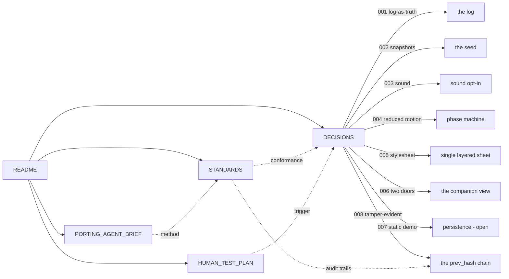

# Loom — documentation map

One screen. Where every doc lives, what it's for, and how they connect.

## The docs

| Doc | For | Read it when |
|---|---|---|
| [`README.md`](../README.md) | A visitor landing in the app cold | You want to know what the Loom is, who it's for, and how to run it |
| [`STANDARDS.md`](./STANDARDS.md) | A reviewer checking conformance | You're about to change a target size, a motion rule, or an AAF attribute |
| [`DECISIONS.md`](./DECISIONS.md) | A future contributor | You're wondering why something is the way it is, or what's still open |
| [`HUMAN_TEST_PLAN.md`](./HUMAN_TEST_PLAN.md) | Whoever is running the family test | You're about to put the app in front of a human |
| [`PORTING_AGENT_BRIEF.md`](./PORTING_AGENT_BRIEF.md) | Whoever is porting a new app into the canon | You're starting a new app that consumes `@p31/canon` |
| [`CONCEPTS.yml`](./CONCEPTS.yml) | The concept registry | You want the canonical definition of the log, the gate, Lumi, the artifact… |
| [`PORTING_INVENTORY.md`](./PORTING_INVENTORY.md) | — | Generated. Do not read; the generator reads it. |
| [`DOCS_INVENTORY.md`](./DOCS_INVENTORY.md) | — | Generated. Do not read; the generator reads it. |

## How the pieces fit

## The concept graph

The concepts below recur across the docs and the code. Their canonical
definitions live in [`CONCEPTS.yml`](./CONCEPTS.yml); the weave inserts a link
wherever they appear bare.

- **the log** — the append-only event log; the source of truth every visible
  state folds over. Canonical: `DECISIONS.md` #001.
- **the gate** — the canon's writer-per-kind check. Canonical:
  `packages/canon/src/loom/gate.ts`.
- **Lumi** — the agent's face. Canonical: `apps/loom/src/components/Lumi.tsx`.
- **the companion view** — the elder's window. Canonical: `DECISIONS.md` #006.
- **the canon** — the design system the Loom consumes. Canonical:
  `packages/canon/src/theming/theme-store.ts`.
- **the phase machine** — `waiting → celebrating → celebrated`, driven by
  `animationend`. Canonical: `DECISIONS.md` #004.
- **the artifact** — what the child and Lumi made. Canonical:
  `apps/loom/src/components/MadeArtifact.tsx`.
- **the seed** — `events.seed.json`, the static deploy's demo seed. Canonical:
  `DECISIONS.md` #002.
- **the prev_hash chain** — the log's tamper-evidence layer: each record links
  to the one before it; `/verify` recomputes and names any break. Canonical:
  `packages/canon/src/loom/hash-chain.ts`, `DECISIONS.md` #008.

## Related Documents

- `../README.md` — the front door; read this map as its companion index
- `./STANDARDS.md` — the conformance the whole corpus claims
- `./DECISIONS.md` — the decisions the concepts above resolve to
- `./HUMAN_TEST_PLAN.md` — the test that decides whether the design works
- `./PORTING_AGENT_BRIEF.md` — the method for the next app
- `./CONCEPTS.yml` — the registry this page renders
- `./SECURITY.md` — the security, privacy, and conformance posture
