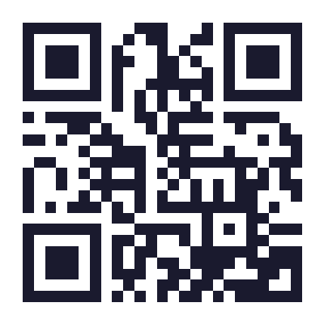
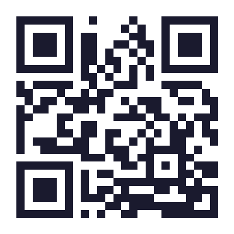
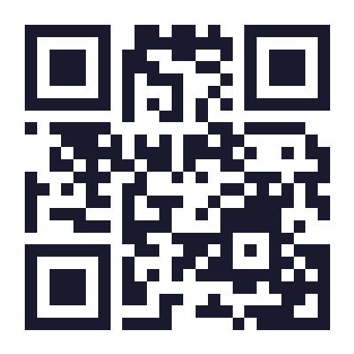
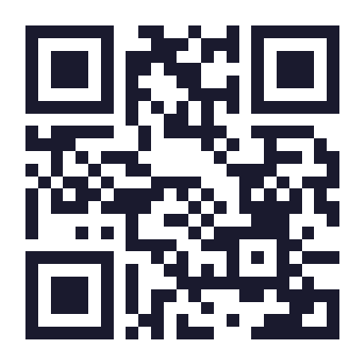
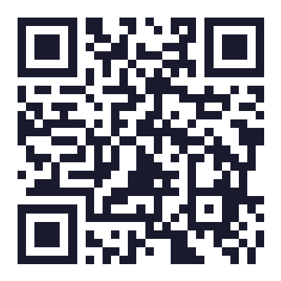
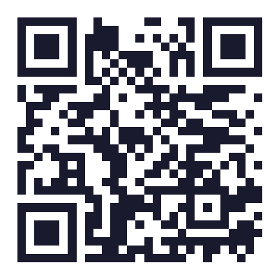

# The Shapes That Build Us

## A P31 Labs Explorer's Guide

### For curious kids who want to know how their brain, their body, and the universe stick together.

---

## Page 2 — Meet Cal

Hi! I'm Cal.

I'm a calcium atom. I live inside your bones, your blood, and your brain.

I'm very small — way too small to see — but I have a very big job.

I help your brain send messages. I help your muscles move. I help you think, feel, and play.

And I'm about to take you on an adventure through the shapes that build us.

**Turn the page — let's go!**

---

## Page 3 — The Strongest Shape in the Universe

Have you ever seen a bridge that wobbles? Or a table that tips over?

That's because **squares are wobbly**.

But **triangles are not**.

Triangles are the universe's favorite building block. No matter how hard you push on a triangle, it won't fold or bend.

---

## Page 4 — The Tetrahedron

Now imagine a triangle growing up into a 3D shape. It becomes a **pyramid** — also called a **tetrahedron**.

It has:
- **4 corners**
- **6 edges**
- **4 faces** (each one is a triangle)

And it is the **strongest shape in the universe**.

> **Science Fact:** In geometry, this is called the complete graph K₄ — the simplest shape where every corner is connected to every other corner. Engineers use it to build bridges, towers, and space probes.

---

## Page 5 — Fold Your Own K₄

Ask a grown-up to help you cut along the dotted lines, fold along the solid lines, and tape the tabs.

When you're done, you'll be holding the strongest shape in the universe!

---

## Page 6 — The Brain's Battery

Your brain is like a super-fast computer.

It runs on **electricity**.

And that electricity is powered by tiny sparks made of **calcium** — the same stuff in milk, cheese, and your bones.

**Color in the calcium sparks above. Make them glow!**

---

## Page 7 — The Calcium Cage

Calcium is very strong, but it's also very fragile.

It needs a **cage** to stay safe.

That cage is made of **phosphorus** — a different atom that wraps around calcium like a shield.

When calcium and phosphorus work together, your brain's battery stays full and your sparks flow smoothly.

> **Science Fact:** These calcium-phosphorus cages are called Posner molecules (Ca₉(PO₄)₆). Scientists have found them in brain tissue, and they may be one of the ways your brain stores and releases energy for thinking.

---

## Page 8 — When the Battery Gets Low

But sometimes, **calcium gets low**.

When that happens, the sparks get dizzy. Your brain's battery drains faster.

You might feel:
- Wobbly
- Tired
- Like things are too loud or too bright
- Grumpy for no reason

**This is not your fault.** It just means your battery needs to recharge.

Eating calcium-rich foods, getting some sun (vitamin D), and resting all help keep your sparks flowing.

---

## Page 9 — The Battery Check

Every morning, you wake up with a **full battery**.

Playing, thinking, loud noises, bright lights — they all use some of that battery.

When your battery is full, you feel **bouncy**.

When it's low, you feel **wobbly**.

**Grab a crayon! Color in how full your battery feels right now.**

---

## Page 10 — Crossed Wires

Different things use different amounts of battery. Your friend might lose battery from things that don't bother you — and that's okay.

Everyone's battery is different.

When your battery gets too low, your wires can feel crossed. Your thoughts might get jumbled. Sounds might feel too sharp. Your body might feel heavy.

**In our lab, we call this a Floating Neutral** — it's what happens when an electrical system loses its ground connection. The voltage gets unpredictable. Just like your brain when it's overwhelmed.

> **For Grown-Ups:** This is sensory overload and interoception — the ability to sense your body's internal state. Many neurodivergent children struggle with interoception. The free PHOS tool (phos.p31ca.org) is an open-source, spoon-aware interface that adapts to the user's available cognitive energy in real-time.

---

## Page 11 — The Recharge Control Panel

When your battery is flashing red, you get to choose how to plug it back in. Everyone's control panel is wired differently!

**Circle the buttons that work best for your battery:**

| 🤫 **QUIET TIME** | 🫂 **A HUG** (ask first!) |
| :---: | :---: |
| 💧 **DRINK WATER** | 🥨 **FAVORITE SNACK** |
| 🎧 **SAFE MUSIC** | 🪀 **ROCKING / STIMMING** |
| ⛺ **ALONE TIME** | 🛋️ **BODY DOUBLE** (sitting together quietly) |

---

**What is your Ultimate Recharge Sequence?**
*Draw your top 3 steps to get your battery back to green:*

---

## Page 12 — The PHOS Energy Tracker

> **Scan this QR code with a grown-up nearby**

**PHOS** is a free tool we built at P31 Labs. It helps you track your energy throughout the day — without words, without questions, without pressure.

You just move a slider to show how many spoons you have right now. The screen adapts to you — dark mode when your eyes are tired, simple mode when your brain is full, calm colors when you need quiet.

**Try it at phos.p31ca.org**

---

## Page 13 — Let's Play Chemistry

Now that you know about tetrahedrons and calcium sparks, it's time to **build your own molecules**.

The BONDING game lets you match atoms together — just like real chemistry!

You connect atoms by matching their properties. Some atoms like to share electrons. Some like to give them away. Some form strong covalent bonds, and some form ionic bonds.

When you build a molecule in the game, you're doing the same thing your body does every second — using chemistry to create something new.

---

## Page 14 — Molecule Cheat Sheet

| Molecule | Formula | Shape | Found In |
|----------|---------|-------|----------|
| Water | H₂O | Bent | Everywhere! You're mostly water |
| Salt | NaCl | Cubic | Your tears, your sweat, your blood |
| Calcium Carbonate | CaCO₃ | Hexagonal | Eggshells, seashells, chalk |
| Glucose | C₆H₁₂O₆ | Ring | Your body's fuel |
| DNA | Varies | Double Helix | Every cell in your body |

**Try to build these in the BONDING game!**

> **Scan this QR code to play BONDING right now!**

---

## Page 15 — Junior Architect Blueprint

You know how the strongest shape (K₄) works. You know how the calcium battery runs. You know how atoms bond.

**Now, it's your turn to be the Systems Architect.**

If you could invent a brand new molecule to help your brain or your body, what would it be? Fill out your official lab blueprint below!

**MOLECULE NAME:** __________________________________

**GEOMETRY (What shape is it?):** _____________________

**THE SUPERPOWER (What does it do?):**
_____________________________________________________
_____________________________________________________

**DRAW YOUR MOLECULE HERE:**

---

*Example: "Molecule of Calm" — shaped like a tetrahedron, helps your brain feel steady.*

---

## Page 16 — For Grown-Ups: Parent & Teacher Guide

### What is P31 Labs?

P31 Labs, Inc. is a Georgia nonprofit corporation (EIN 42-1888158) building open-source cognitive infrastructure for neurodivergent people. We are 501(c)(3) pending.

Our founder, William R. Johnson, is AuDHD — autistic and ADHD — and a single father of two neurodivergent children. Everything we build comes from lived experience.

### Why this booklet?

We built this booklet to translate complex concepts — calcium regulation, tetrahedral geometry, cognitive load theory — into a format that children can explore at their own pace. It's designed to be:

- **Printable** at home or school (8.5" x 11", black-and-white friendly)
- **Interactive** with coloring, drawing, and cut-out activities
- **Trauma-informed** — never pathologizing, always affirming
- **Open source** — share it, adapt it, improve it

### 📋 Institutional Compliance & Alignment

This resource is engineered to directly support institutional curriculum and therapeutic standards:

**[ NGSS ALIGNMENT ] — Next Generation Science Standards**
* **PS1.A (Matter and Its Interactions)** & **ETS1 (Engineering Design)**.
* *Application:* Modules 1, 2, and 4 translate foundational physical science concepts (tetrahedral geometry, atomic bonding, calcium kinematics) into concrete, hands-on engagement for early learners.

**[ CASEL ALIGNMENT ] — Social-Emotional Learning**
* **Self-Awareness** & **Self-Management**.
* *Application:* Module 3 explicitly teaches interoception. By providing a mechanical framework for cognitive load ("The Floating Neutral" / "Battery Check"), children develop a shame-free vocabulary to communicate their internal regulatory states.

**[ UDL COMPLIANT ] — Universal Design for Learning**
* *Application:* This booklet provides multiple means of engagement (tactile cut-outs, coloring), representation (text, visual diagrams, QR integration), and expression (blueprint design, control panel selection).

### 🧠 Neurodiversity-Affirming Architecture

This is not a behavioral modification tool. The language herein is strictly neurodiversity-affirming:
* **Zero Pathologizing:** Fluctuations in energy and sensory processing are framed as mechanical variations, not deficits.
* **Shame-Free Vocabulary:** "Dizzy sparks" and "low battery" reframe executive dysfunction from a moral failure to a physiological reality.

### Links

| Resource | URL | QR Code |
|----------|-----|---------|
| BONDING game | bonding.p31ca.org |  |
| PHOS energy tracker | phos.p31ca.org |  |
| P31 Labs website | p31ca.org |  |
| GitHub organization | github.com/p31labs |  |
| Substack newsletter | thegeodesicself.substack.com |  |
| Ko-fi shop | ko-fi.com/trimtab69420/shop |  |

### How to support us

- **Download our products** (PWYW $0 minimum) at ko-fi.com/trimtab69420/shop
- **Follow our work** on Substack at thegeodesicself.substack.com
- **Contribute** on GitHub at github.com/p31labs
- **Share this booklet** with a family, teacher, or therapist who needs it

### License

This booklet is released under the Creative Commons Attribution-ShareAlike 4.0 International License (CC BY-SA 4.0). You are free to share and adapt it for any purpose, as long as you credit P31 Labs and share alike.

---

*The Shapes That Build Us — A P31 Labs Explorer's Guide*
*Built with love by a dad who wanted his kids to understand how amazing their brains are.*
*Ca₉(PO₄)₆*
