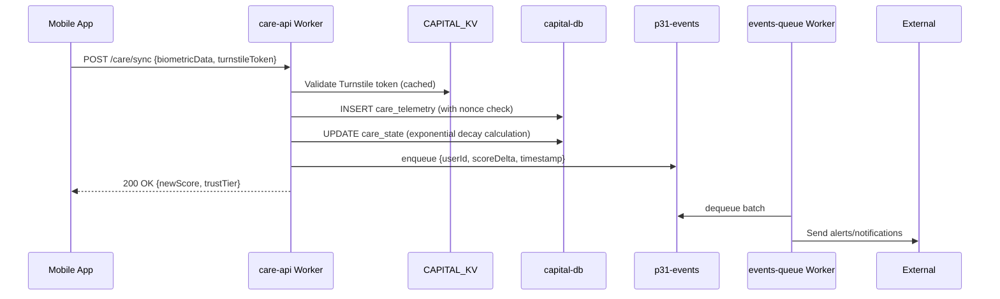
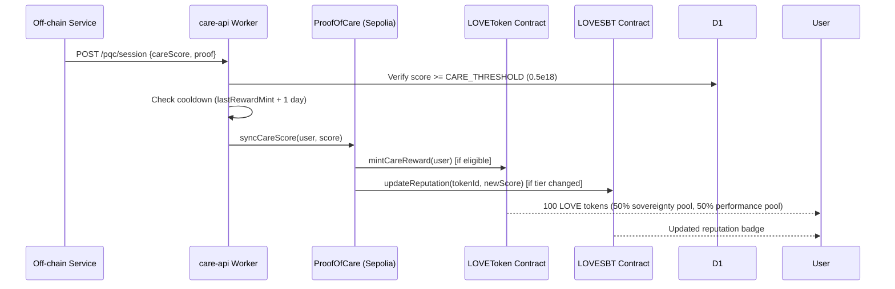

# P31 Capital Machine — Architecture

> **⚠️ Retired architecture (historical reference).** `LOVEToken.sol` was **archived** in Phase 1 — there is no on-chain LOVE ERC20. LOVE balances now live in the off-chain `love-ledger` worker (two-pool model); on-chain attestations are `LOVESBT` (ERC-5192) + `GenesisSpark` badges. See [`docs/LOVE_ECONOMY.md`](./LOVE_ECONOMY.md) for the current architecture. This document describes the pre-archive design.

## Overview
The P31 Capital Machine is a decentralized system for verifying and rewarding care work through cryptographic identity, reputation scoring, and blockchain incentives. Built on Cloudflare Workers with D1 storage, KV caching, and Queues for async processing.

## Four-Layer Architecture

### 1. Foundation — Cryptographic Identity & Post-Quantum Cryptography
- **Identity System**: Passphrase-derived deterministic keys via PBKDF2-HMAC-SHA256 (310,000 iterations)
- **Authentication**: ECDSA P-256 signatures for identity verification (no passwords, no central authority)
- **Post-Quantum Security**: 
  - Key Encapsulation: ML-KEM-768 (FIPS 203) + ECDH P-256 hybrid via HKDF-SHA256
  - Signatures: ML-DSA-65 (FIPS 204) for payload authentication
  - Symmetric Encryption: AES-256-GCM for session data
- **Key Management**: Deterministic salt enables cross-device identity recovery
- **without username/password]

### 2. Structure — Reputation Engine
- **Scoring Algorithm**: Exponential decay with 30-day half-life
- **Confidence Weighting**: Diminishing returns formula `1 - 1/(1 + interactionCount/30)`
- **Composite Score**: 40% biometric + 40% social bonds + 20% ledger activity
- **Trust Tiers**: `trustTier = floor(careScore / 0.5e18)` where 0.5e18 = 1 tier level
- **Storage**: TTL-based namespaces with LRU eviction at 4MB budget

### 3. Housekeeping — Data Storage & Integrity
- **Database**: D1 (SQLite) with 51 tables across `capital-db`
- **Core Tables**:
  - `identities`: Public keys, metadata, creation timestamps
  - `care_state`: Current scores, trust tiers, last update
  - `care_telemetry`: Time-series biometric and behavioral data
  - `care_nonces`: Replay protection (UNIQUE constraint on nonce)
- **Atomic Operations**: D1 `.batch()` for all mutations (no BEGIN/COMMIT)
- **Replay Prevention**: UNIQUE constraint prevents nonce reuse
- **Caching**: KV namespaces for rate limits and interaction counts (eventually consistent)

### 4. Connection — Edge-to-Cloud Sync
- **Worker Fleet**: 30 Cloudflare Workers (Free Plan compliant)
  - `care-api`: Main API endpoints (/care/sync, /care/state, /care/rewards)
  - `events-queue`: Consumer for p31-events queue (alerting, analytics)
  - `pdf-generator`: Browser Rendering for care reports and certificates
  - Plus 27 specialized workers for analytics, notifications, etc.
- **Communication**:
  - Request/Response: HTTPS over Cloudflare network
  - Async: Cloudflare Queues (`p31-events`) for decoupled processing
  - Real-time: WebSocket connections via Durable Objects (where implemented)
- **Sybil Resistance**: 
  - Cloudflare Turnstile on all mutation endpoints
  - Rate limiting: 10 requests per 60 seconds per identity
  - Nonce validation with blockchain-style mempool prevention
- **Performance**:
  - Global Cloudflare edge network (<50ms latency worldwide)
  - D1 read replicas for geographical proximity
  - KV edge caching for frequently accessed data

## Data Flows

### Care Score Submission

### Reward Distribution

## Security Boundaries
- **Trust Zone 1**: User device (holds identity keys, performs biometric sensing)
- **Trust Zone 2**: Cloudflare Edge (TLS termination, DDoS mitigation, Worker execution)
- **Trust Zone 3**: D1 Database (encrypted at rest, access-limited to Workers)
- **Trust Zone 4**: External Systems (blockchain, email, SMS - authenticated via API keys)

## Failure Modes & Mitigations
1. **Worker Crash**: Stateless design enables instant restart; state in D1/KV
2. **D1 Corruption**: Point-in-time recovery via backups; read replicas for HA
3. **KV Inconsistency**: Eventually consistent; critical paths use D1 for strong consistency
4. **Network Partition**: Users queue requests locally; retry with exponential backoff
5. **Key Compromise**: Passphrase-based keys allow recovery via social trust graph
6. **Replay Attack**: D1 UNIQUE nonce constraint prevents reuse
7. **Rate Limit Abuse**: Per-identity limits + global CAPTCHA-like thresholds