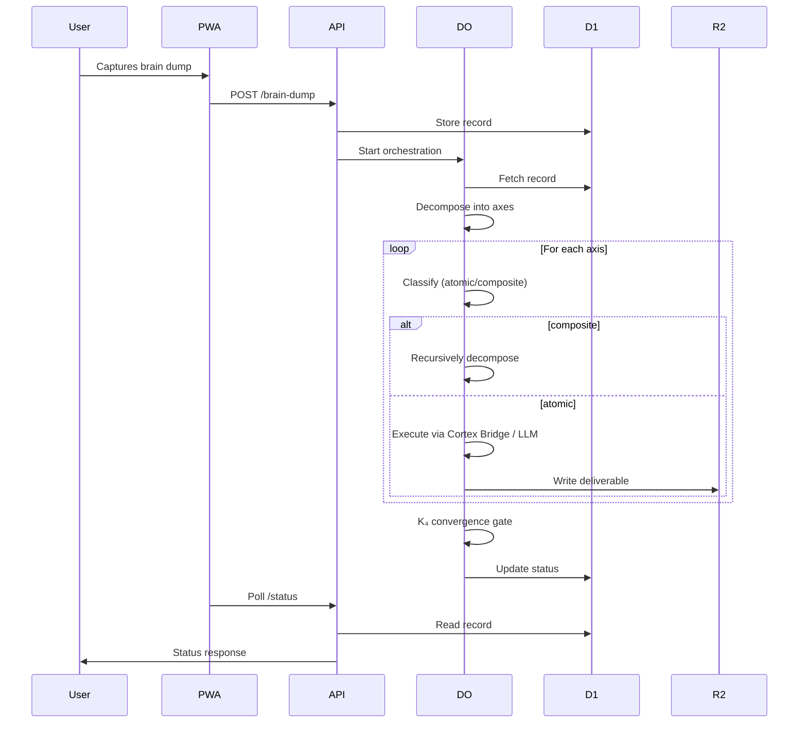

# Jitterbug Sierpinski Orchestrator — Architecture

## 1. Philosophical Foundation

The Jitterbug is not a tool; it is a **way of life** — an exocortex that follows you across every device, every context, every thought. It scales by becoming invisible.

### 1.1 Core Principles

| Principle | Description |
|-----------|-------------|
| **Self-similarity** | Every axis can become a brain dump, spawning sub-axes ad infinitum (Sierpinski recursion). |
| **Isostatic Rigidity** | A four-agent peer-review mesh (K₄) guarantees truth convergence before propagation. |
| **Floating Neutral** | The system isolates the operator from environmental noise to prevent biological collapse (cortisol-calcium axis). |
| **Ephemeralization** | The ghost architecture — wakes, processes, dissolves — scales to zero when idle. |

## 2. Technical Architecture

### 2.1 The 5-Layer Orchestration Pattern

| Layer | Component | Responsibility |
|-------|-----------|----------------|
| **1** | Brain Dump Capture | Structured intake with Zod validation |
| **2** | Decomposition | Rule-based identification of 3–8 independent axes |
| **3** | Agent Runtime | Pluggable adapters (Claude Code, Cortex Bridge, LLM) |
| **4** | Parallel Orchestration | Concurrency-controlled execution with retry policies |
| **5** | Convergence Gate | Gate checks, blocker analysis, rollback loops |

### 2.2 Recursive Extension

- `classifyAxis` — determines if an axis is atomic or composite.
- `axisToBrainDump` — converts an axis back into a full `BrainDump`.
- `K4GateChecker` — enforces 4-agent consensus (fast heuristic or full LLM).
- `RecursiveBrainDumpOrchestrator` — depth-first execution with max depth control.

### 2.3 Deployment Stack

| Layer | Technology |
|-------|------------|
| **Edge Runtime** | Cloudflare Workers + Durable Objects |
| **Database** | D1 (SQLite) |
| **Object Storage** | R2 |
| **Cache** | KV (60s TTL) |
| **Frontend** | React PWA (Vite) |
| **Orchestration** | `@p31/brain-dump-orchestrator` |

## 3. Data Flow

## 4. Key Components

### 4.1 BrainDumpOrchestrator (Core)

- Accepts `OrchestratorDependencies` (tracker, statusTracker)
- Runs axes in parallel with concurrency control
- Supports pluggable runners: `ClaudeCodeRunner`, `GenericLLMRunner`, `CortexBridgeAdapter`, `NoOpRunner`

### 4.2 RecursiveBrainDumpOrchestrator (Extension)

- Extends `BrainDumpOrchestrator`
- Uses `classifyAxis` to determine if a node should recurse
- Writes artifact bubbles to R2
- Applies K₄ gate at every level

### 4.3 K4GateChecker

- Wraps `GateChecker`
- Adds 4-agent consensus (Critic, Refiner, Validator)
- Fast mode uses heuristic; full mode uses LLM
- Verifies edges: factuality, relevance, formatting, constraints, bias, logic

### 4.4 Jitterbug API (Worker)

- REST endpoints: `/health`, `/brain-dump` (POST), `/brain-dump/:id` (GET), `/brain-dump/:id/status` (GET), `/brain-dump/:id/stream` (SSE)
- PSK authentication
- KV cache for status (60s TTL)
- SSE polls D1 every 5s, uses KV cache first

### 4.5 Durable Object (OrchestratorDO)

- Dynamically imports recursive orchestrator when `max_depth > 0`
- Try-catch fallback to non-recursive orchestrator
- Uses R2 deliverable tracker (or in-memory fallback)
- Status tracker: KV or D1

## 5. Security & Compliance

- **PSK Authentication** — Bearer token for API access
- **CORS** — Preflight handling for cross-origin requests
- **ADA Compliance** — The system is a prescribed assistive device (Docket 103)
- **Open Source** — CC BY 4.0 / MIT licensed

## 6. Performance & Scaling

- **Concurrency** — Configurable, default 4
- **Timeout** — Per-axis 300s; K₄ LLM 30s
- **Ephemeral Storage** — R2 with 30-day lifecycle (manual)
- **Cache** — KV with 60s TTL reduces D1 reads by ~90%
- **SSE** — 5s poll, KV cache, closes on terminal status

## 7. Future Extensions

- Real 4-agent LLM consensus (currently heuristic)
- Queue decoupling for long-running orchestrations
- WebSocket push for real-time updates
- Custom domain alias for PWA
- Full test suite execution (pool version upgrade)
